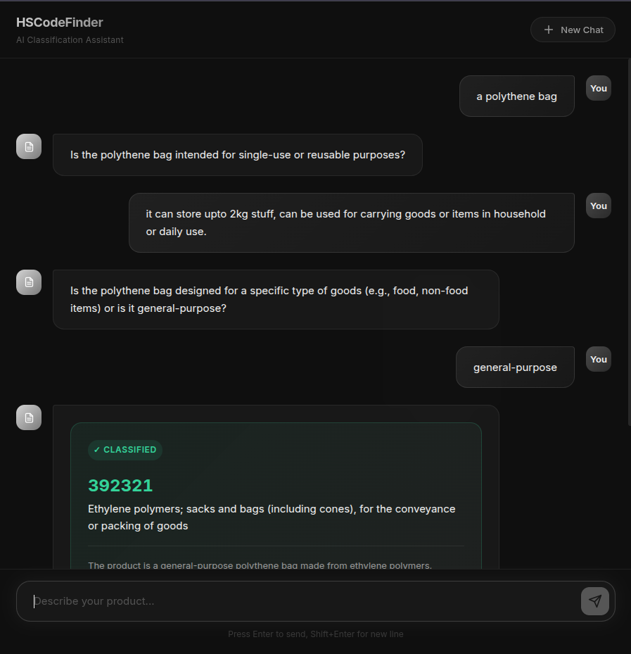

# HS Code Finder

An intelligent **Harmonized System (HS) code classification assistant** that helps you find the correct HS code for any product through natural conversation.

**Describe your product in plain language** → Get the accurate 6-digit HS code with a clear explanation.

  



---

## Features

- **Conversational Classification** — Chat naturally, no need to search through lists
- **AI-Powered Reasoning** — GPT-4o Mini asks smart clarifying questions
- **Semantic Search** — FAISS vector search finds relevant codes from 6,800+ HS entries
- **Full Hierarchy** — See the complete classification path (chapter → heading → subheading)

## Architecture

```
User → Chat UI → FastAPI API → Classification Engine
                                    ├── Embedding Service (all-MiniLM-L6-v2)
                                    ├── Vector Search (FAISS, 6842 vectors)
                                    └── GPT-4o Mini (reasoning + questions)
```

| Component         | Technology                                          |
| ----------------- | --------------------------------------------------- |
| **Backend**       | Python 3.10+, FastAPI, Uvicorn                      |
| **Embeddings**    | sentence-transformers (`all-MiniLM-L6-v2`, 384-dim) |
| **Vector Search** | FAISS (`IndexFlatIP`, cosine similarity)            |
| **LLM**           | OpenAI GPT-4o Mini                                  |
| **Frontend**      | Vanilla HTML/CSS/JS                                 |
| **Dataset**       | UN Comtrade HS taxonomy (5,613 subheadings)         |

## Quick Start

### 1. Clone & Install

```bash
git clone https://github.com/its-harshitgoel/HS_Code_Finder.git
cd HS_Code_Finder
pip install -r backend/requirements.txt
```

### 2. Configure

```bash
cp .env.example .env
```

Edit `.env` and add your [OpenAI API key](https://platform.openai.com/api-keys):

```
OPENAI_API_KEY=your_key_here
```

### 3. Run

```bash
python -m uvicorn backend.main:app --host 0.0.0.0 --port 8001
```

Open **http://localhost:8001** and start classifying.

> First startup takes ~60s to download the embedding model and build the FAISS index. Subsequent startups use the cached model.

## Project Structure

```
HS_Code_Finder/
├── backend/
│   ├── api/
│   │   └── routes.py          # FastAPI endpoints (/classify, /health)
│   ├── models/
│   │   └── schemas.py         # Pydantic data models
│   ├── services/
│   │   ├── classifier.py      # Classification engine (FAISS + OpenAI)
│   │   ├── embedding.py       # Sentence-transformer embeddings
│   │   ├── hs_knowledge.py    # HS dataset loader & hierarchy
│   │   ├── llm_service.py     # OpenAI API wrapper
│   │   └── vector_search.py   # FAISS index & search
│   ├── utils/
│   │   ├── logger.py          # Structured logging
│   │   └── text_processing.py # Text normalization
│   ├── main.py                # App entry point
│   └── requirements.txt
├── frontend/
│   ├── index.html             # Chat interface
│   ├── style.css              # Dark theme
│   └── app.js                 # Chat logic
├── data/
│   └── hs_codes.csv           # HS classification dataset
├── tools/
│   ├── load_dataset.py        # Dataset downloader
│   └── build_index.py         # Index builder + test queries
├── .env.example               # Environment template
└── README.md
```

## API Endpoints

### `POST /api/classify`

```json
{ "session_id": null, "message": "frozen shrimp seafood" }
```

**Response** (question):

```json
{
  "session_id": "uuid",
  "type": "question",
  "message": "Are these cold-water shrimps, or another type?",
  "candidates": []
}
```

**Response** (result):

```json
{
  "session_id": "uuid",
  "type": "result",
  "final_result": {
    "hs_code": "030617",
    "description": "Crustaceans; frozen, shrimps and prawns..."
  }
}
```

### `GET /api/health`

Returns system status, dataset state, and index info.

## License

MIT

---

Built with FastAPI, FAISS, and OpenAI
